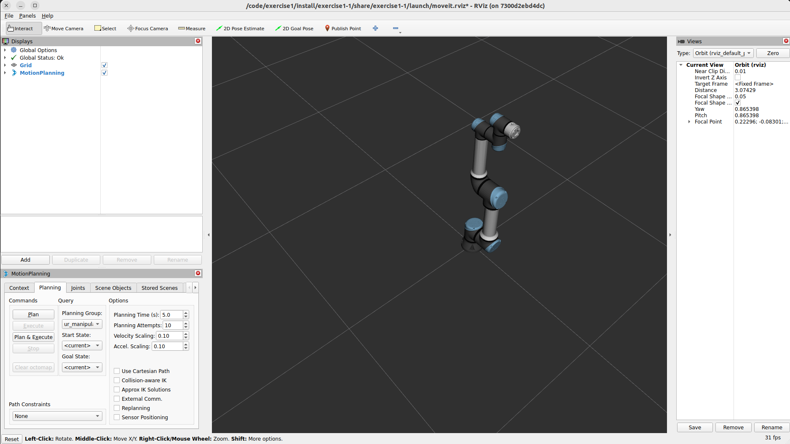
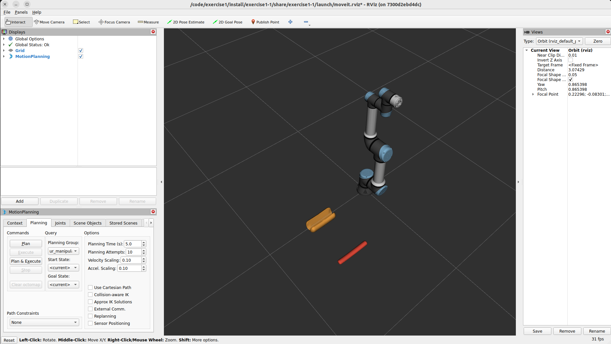
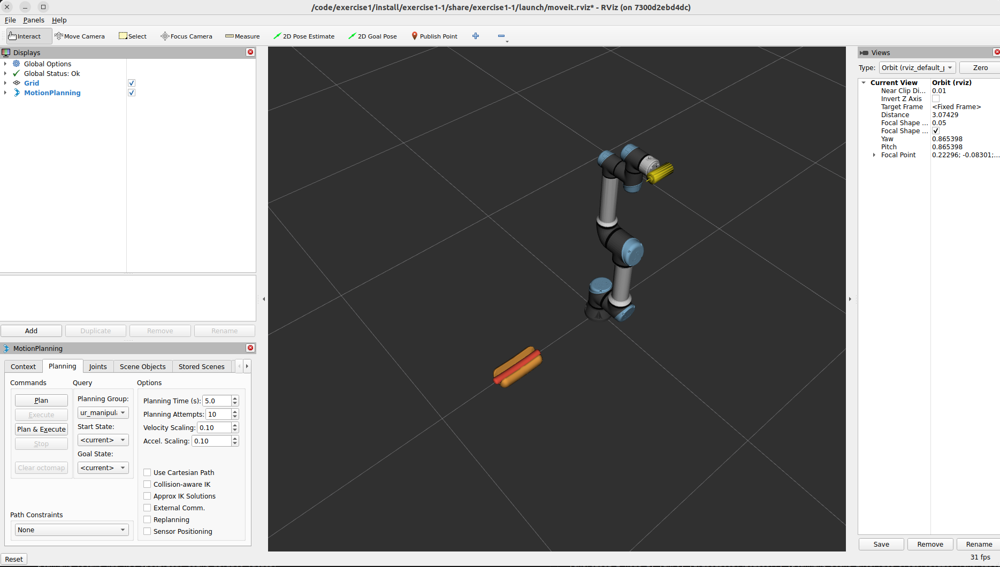
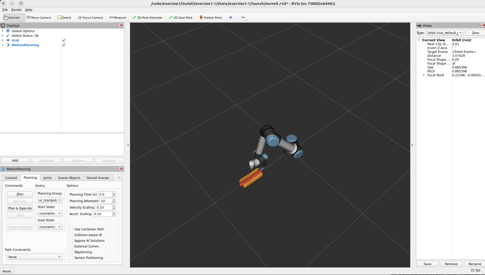

# Exercise 1

This workspace contains packages to demonstration motion planning using a UR robot assembling a hot dog.
If you have not already done so, make sure to follow the [set up instructions](../README.md#workshop-setup) to ensure the exercise works on your computer.

## Basic Usage

This directory is a colcon workspace.
It contains two exercise packages, and a package containing the hot dog assets.

To build the workspace, change directories into the `exercise1` directory and build with colcon:

```bash
cd exercise1
colcon build
```

### Exercise 1-1

In this exercise, we have a hot dog bun and a sausage in reach of the robot.
We'd like to pick up the sausage and place it into the bun to assemble ourselves a nice snack.

Before running exercise 1-1, first source the workspace, then launch the UR:

```bash
source install/setup.bash
ros2 launch exercise1-1 ur.launch.py
```

You should see an RViz window with the UR.



Now, you can run exercise 1-1 to try motion planning. Open a new terminal:

```bash
docker/shell
cd exercise1
```

Run exercise1-1:

```bash
source install/setup.bash
ros2 launch exercise1-1 exercise1-1.launch.py
```

You should see a sausage and bun appear beside each other, in front of the robot. By default, planning will fail.



In exercise 1-1, we:
 1. Set the pose target to a pose defined just above the sausage
 2. Generate a motion plan and execute it
 3. Attach the sausage collision object to the robot
 4. Set the pose target to a pose defined just above the bun
 5. Generate a motion plan and execute it

The solution can be found [here](./src/exercise1-1/solution/main.cpp).

This will make the robot move to the sausage, pick it up, move to the bun, and place the sausage into the bun.

### Exercise 1-2

In this exercise, we have our assembled hot dog, and the robot has a bottle of mustard.
We want to add some mustard onto our hot dog.
To start off, the robot will plan to a pose just above the hot dog, similarly to how we created motion plans and executed them in exercise 1-1.

We're ready to apply the mustard, but there's one issue: we don't want to use the normal planning pipeline to generate this plan.
The normal planning pipeline will generate a path, but it may involve some unintuitive motions.
Applying mustard with these sort of motions would definitely create a mess.
We want to create a Cartesian plan to apply our mustard.

Before running exercise 1-2, first source the workspace, then launch the UR:

```bash
source install/setup.bash
ros2 launch exercise1-2 ur.launch.py
```

You should see an RViz window with the UR.


Now, from the second terminal, you can run exercise 1-2 to try motion planning:

```bash
source install/setup.bash
ros2 launch exercise1-2 exercise1-2.launch.py
```

You should see the assembled hot dog from exercise 1-1 in front of the robot, which is holding a mustard bottle:



In this exercise, the robot will move to a pose holding the mustard bottle just above the hot dog, similarly as to exercise 1-1.



By default, planning to apply the mustard will fail.
In exercise 1-2, we:
 1. Configure the parameters used for Cartesian planning
 2. Generate a Cartesian motion plan and execute it

The solution can be found [here](./src/exercise1-2/solution/main.cpp).
